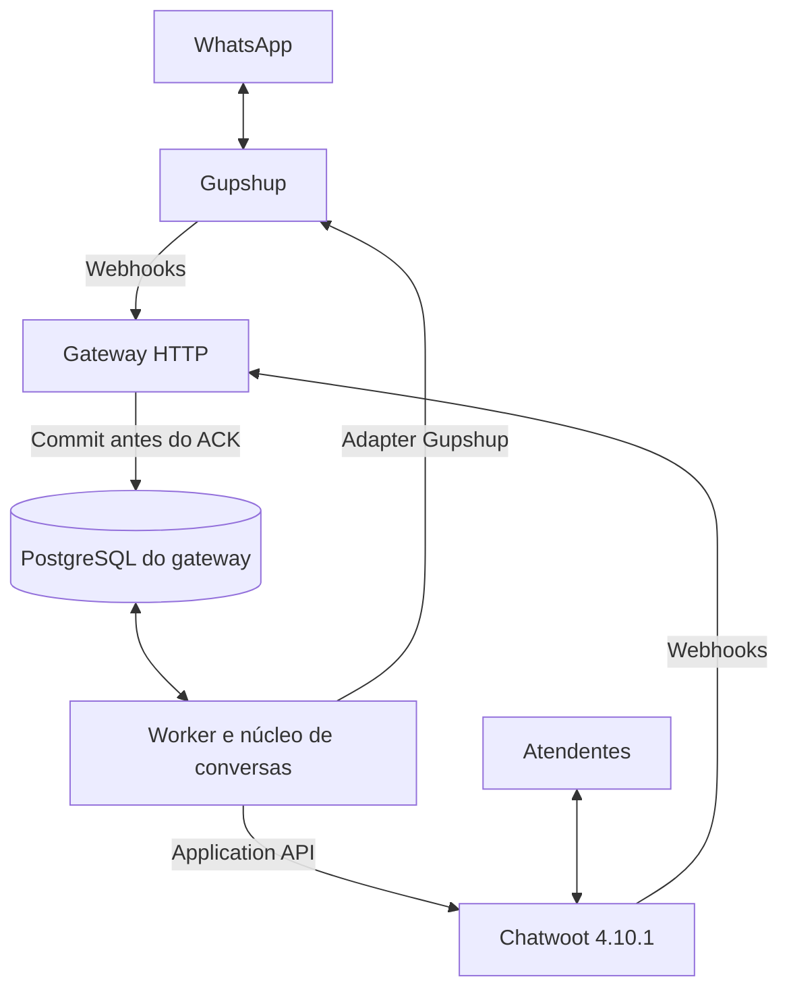

# Arquitetura

## Desenho aprovado e escolhas propostas

O usuário confirmou gateway independente do provedor, Gupshup inicial e Chatwoot como interface humana, sem IA agora. Para executar esse desenho, propõe-se monólito modular Python com API FastAPI, worker separado e PostgreSQL próprio. As escolhas de bibliotecas e versões serão fixadas na implementação.

## Componentes

| Componente | Responsabilidade |
| --- | --- |
| Webhook controllers | Autenticar origem conforme capacidade real, validar envelope, gravar evento e devolver ACK |
| Normalizador | Converter payload externo em mensagem/status internos; separar IDs e unidades de tempo |
| ConversationService | Localizar contato/vínculo, serializar criação e selecionar conversa |
| MessageService | Planejar partes de envio, janela, correlação e efeitos no Chatwoot |
| GupshupProvider | send_text, send_media, send_template, parse_message e parse_status |
| ChatwootClient | Operações de contatos, vínculos, conversas, mensagens e status |
| Repositories | Transações, unicidade, eventos, tarefas e mapeamentos |
| Worker | Claim de tarefas, leases, execução, retentativa segura e reconciliação |

## Fila inicial

Usar tarefas PostgreSQL com claim transacional, bloqueio de linha e SKIP LOCKED. Cada claim tem lease; o worker confirma a conclusão em nova transação. Criar webhook_event e job no mesmo commit. Não manter transação de banco aberta durante HTTP externo.

O dispatcher considera ordenação por channel_id + identidade WhatsApp. Não iniciar a segunda mensagem da mesma direção enquanto a anterior estiver executando ou em resultado ambíguo. Canais/contatos diferentes podem avançar em paralelo. Redis poderá ser introduzido mediante necessidade medida; PostgreSQL permanece fonte de verdade.

## Entrada

Validar app/canal → persistir evento → ACK → deduplicar → normalizar → atualizar última mensagem válida do usuário → localizar contato/vínculo → selecionar conversa → criar incoming → registrar ID Chatwoot → concluir tarefa.

O source_id da mensagem incoming terá uma chave externa estável, distinta do source_id do vínculo contact_inbox. Ela ajuda a reconciliar uma criação cujo retorno se perdeu; não é uma garantia de unicidade remota.

## Saída

Persistir evento Chatwoot → validar conta/inbox/outgoing/private → recuperar conversa e contato → planejar partes → validar janela e conteúdo → criar tentativa durável → chamar Gupshup → gravar messageId → aguardar recibos. Eventos message_updated não acionam novos envios.

## Status

Guardar recibo bruto → correlacionar gsId e WhatsApp ID → guardar evento não correlacionado se necessário → aplicar progressão local → sincronizar mensagem Chatwoot. Falha na sincronização de status agenda somente atualização do Chatwoot, jamais reenvio da mensagem ao WhatsApp.

## Conversas e identidade

O contato representa uma pessoa; o vínculo identifica sua participação em uma inbox. O adapter é propriedade do canal, não da identidade global da pessoa. Usar source_id estável como wa:<channel_uuid>:<wa_id>. Não inserir/remover automaticamente o nono dígito de números brasileiros. Preservar wa_id recebido e separar dele o telefone de exibição.

Para contato conhecido, validar o estado remoto da conversa antes de reutilizar. open, pending e snoozed são reutilizáveis; nova incoming deve resultar em atendimento aberto, conforme comportamento homologado. resolved inicia uma nova conversa. Se houver múltiplas não resolvidas, escolher a mais recente e registrar inconsistência para revisão, sem resolver outras automaticamente.

## Limites

Chatwoot é fonte de verdade para atendentes, equipes e estado da conversa. Gateway é fonte de verdade para transporte, jobs e IDs externos. Gupshup/WhatsApp fornecem recibos de transporte. A integração não depende do banco interno do Chatwoot. Nenhum componente de IA será criado agora.
